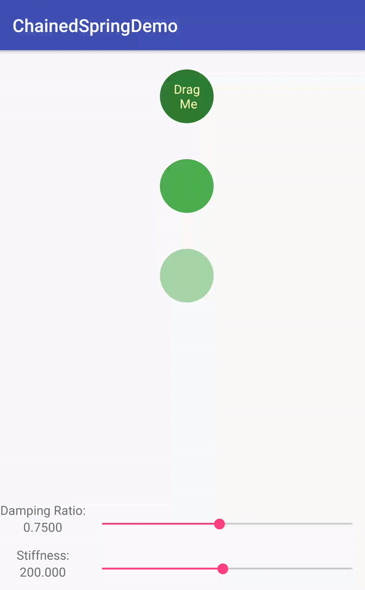

# physicsanimations
demo com.android.support:support-dynamic-animation




https://developer.android.com/guide/topics/graphics/spring-animation.html
https://developer.android.com/guide/topics/graphics/fling-animation.html

## setup
```
dependencies {
    compile 'com.android.support:support-dynamic-animation:26.1.0'
}
```

## usage

1. Create a SpringAnimation object for your View with a specified ViewProperty
2. Create a SpringForce object and set your desired parameters (which are described above).
3. Apply the created SpringForce to your SpringAnimation.
4. Start the animation.

```
        // create an animation for your view and set the property you want to animate
        SpringAnimation animation = new SpringAnimation(view, SpringAnimation.X);
        // create a spring with desired parameters
        SpringForce spring = new SpringForce();
        // can also be passed directly in the constructor
        spring.setFinalPosition(100f);
        // optional, default is STIFFNESS_MEDIUM
        spring.setStiffness(SpringForce.STIFFNESS_LOW); 
        // optional, default is DAMPING_RATIO_MEDIUM_BOUNCY
        spring.setDampingRatio(SpringForce.DAMPING_RATIO_HIGH_BOUNCY);
        // set your animation's spring
        animation.setSpring(spring);
        // animate!
        animation.start();
```

